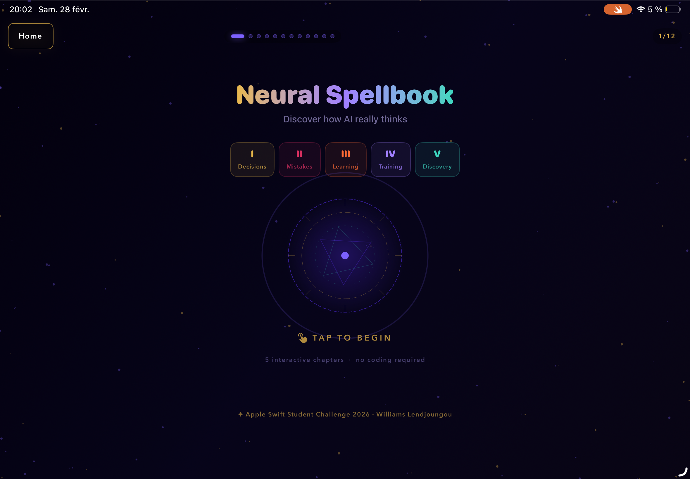
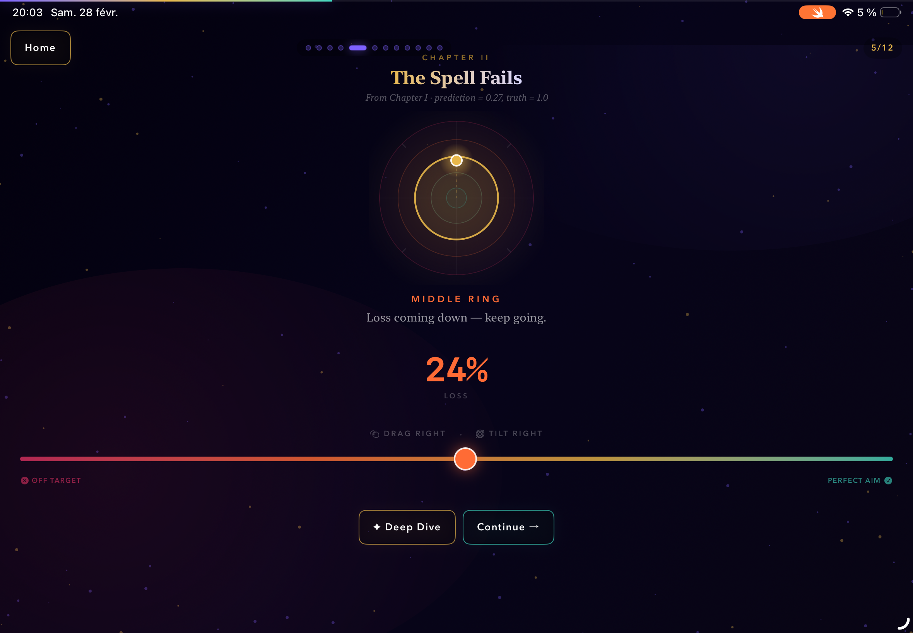
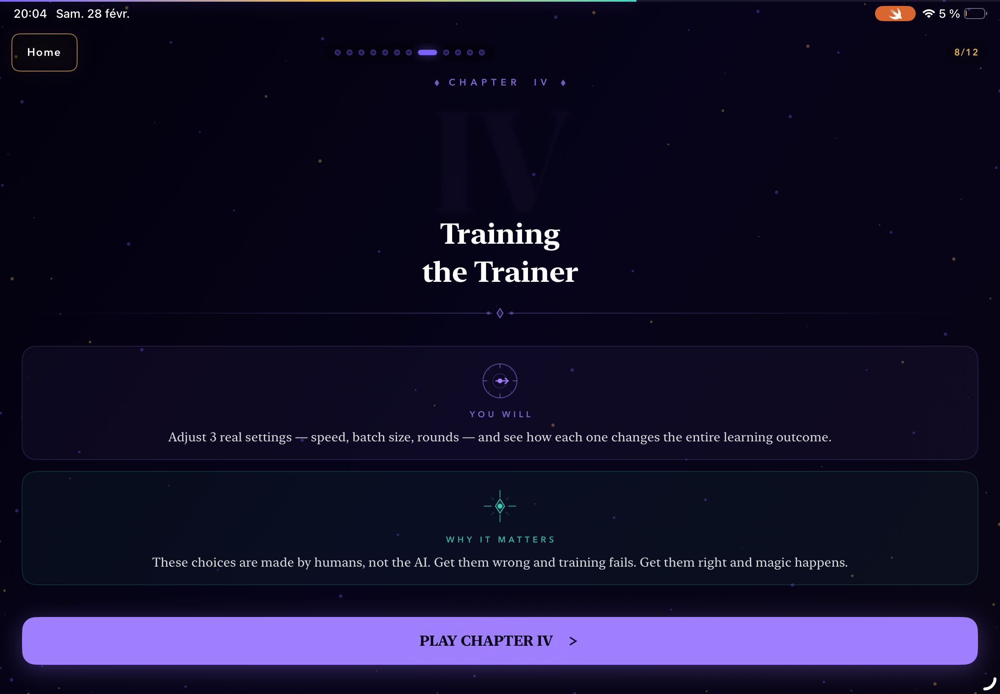

<h1 align="center">NeuralSpellBook</h1>

<p align="center">
  <strong>Discover how AI really thinks — no code required.</strong><br/>
  An interactive iOS educational platform for the Apple Swift Student Challenge 2026.
</p>

<p align="center">
  
  
  
  
  
</p>

<br/>

<p align="center">
  
  
  
</p>

---

## What is NeuralSpellBook?

Neural networks are taught through formulas and slides that describe behavior without letting you *feel* it. Most people leave an ML course knowing the terms but having no intuition for what actually happens inside a forward pass — or why a network fails to learn.

NeuralSpellBook fixes that. It is a fully native iPad app built in **Swift and SwiftUI** that teaches the fundamentals of neural networks through **five interactive chapters**, real-time animated visualizations, and hands-on sliders. No prior knowledge. No code. Just understanding.

---

## Five Chapters

| # | Chapter | What You Learn |
|---|---------|----------------|
| I | **Decisions** | How a neuron makes a prediction (forward propagation) |
| II | **Mistakes** | How loss is measured — and what it looks like live |
| III | **Learning** | How the network corrects itself (backpropagation, visually) |
| IV | **Training the Trainer** | How speed, batch size, and rounds control the outcome |
| V | **Discovery** | Free exploration of a trained network |

> *5 interactive chapters · 12 visual screens · no coding required*

---

## Features

- **Starfield neural canvas** — animated nodes and connections that update in real time as you interact
- **Live loss meter** — Chapter II shows loss as a concrete percentage with a directional ring that physically closes as you correct the prediction
- **Interactive hyperparameters** — Chapter IV exposes three real training settings and shows you what happens when you get them wrong
- **Fully offline** — no network, no backend, no external dependencies
- **iPad-native** — spatial layout, haptic feedback, and gradient typography built for the large canvas

---

## Tech Stack

| Layer | Technology | Role |
|-------|-----------|------|
| UI | SwiftUI | All views, Canvas API animations, chapter layouts |
| Computation | CoreML | In-process neural inference and training simulation |
| State | Combine / @Observable | Propagates ML state updates to the SwiftUI animation system |
| Platform | iPadOS | Spatial layout, haptic feedback, 60fps canvas rendering |

---

## How to Run

1. Clone the repo
2. Open `Package.swift` in **Xcode 15+**
3. Select an **iPad simulator** (or a physical iPad)
4. Hit **Run**

No dependencies to install. No API keys. No configuration.

---

## Architecture

```
App Launch
    └── Chapter Selection (I–V tabs)
            └── Chapter State Machine activates
                    └── Neural Canvas initializes (starfield)
                            └── User interacts (tap / drag / slider)
                                    └── CoreML processes input in real-time
                                            └── Visualization updates live
                                                    └── Chapter completes → next unlocks
```

---

## Built by

**Williams Lendjoungou** — Computer Engineering @ McGill University (Minor: AI)

Submitted to the **Apple Swift Student Challenge 2026**.

> *"These choices are made by humans, not the AI. Get them right and magic happens. Get them wrong and training fails."*
> — NeuralSpellBook, Chapter IV
